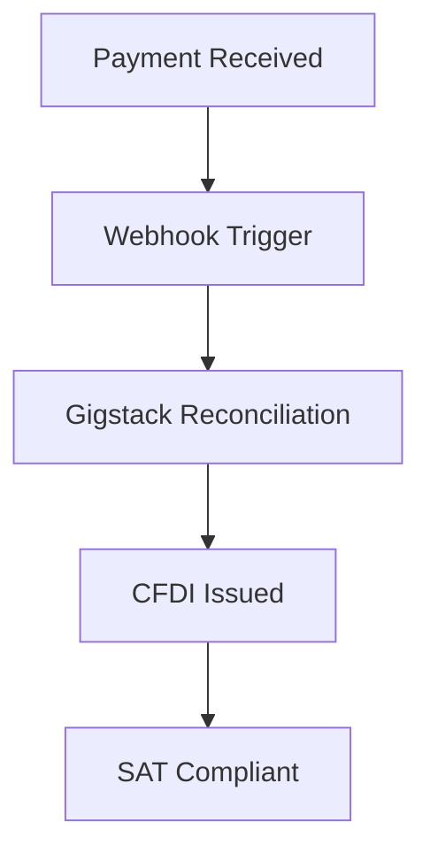

## Overview

Gigstack automates your invoicing and fiscal compliance in Mexico. Connect your payment processors like Stripe or PayPal, and Gigstack generates CFDI facturas automatically upon payment receipt. You gain real-time reconciliation, AI-driven collections, and comprehensive reporting—all integrated with the SAT.

<Callout kind="info">
Gigstack handles CFDI generation compliant with SAT regulations, eliminating manual entry errors.
</Callout>

## Key Features

Explore Gigstack's core capabilities through these highlighted tools.

<Columns cols={3}>
  <Card title="Automated CFDI" icon="file-text" href="#automated-cfdi">
    Generate electronic invoices instantly from payments.
  </Card>
  <Card title="Fiscal Reconciliation" icon="bar-chart-3" href="#fiscal-reconciliation">
    Match payments to SAT requirements automatically.
  </Card>
  <Card title="AI Collections" icon="zap" href="#ai-collections">
    Recover debts with intelligent automation.
  </Card>
  <Card title="Income Tracking" icon="trending-up" href="#income-tracking">
    Monitor revenue with detailed reports.
  </Card>
  <Card title="Mobile Access" icon="smartphone" href="#mobile-dashboard">
    Manage operations from any device.
  </Card>
</Columns>

## Automated CFDI Generation

Set up automated CFDI creation for every payment. Gigstack listens for webhooks from your processor and emits compliant facturas.

<Steps>
  <Step title="Connect Payment Processor" icon="link">
    In your Gigstack dashboard, add your Stripe webhook endpoint.
  </Step>
  <Step title="Configure Webhook" icon="settings">
    Point Stripe to `https://api.gigstack.pro/webhooks/stripe`.
  </Step>
  <Step title="Test Generation" icon="play">
    Process a test payment to verify CFDI output.
  </Step>
</Steps>

```javascript
// Example Stripe webhook handler response from Gigstack
{
  "cfdi_uuid": "123e4567-e89b-12d3-a456-426614174000",
  "status": "issued",
  "sat_xml_url": "https://sat.gigstack.pro/xml/abc123"
}
```

<Image
  src="https://gigstack.io/images/dashboard-hero-mx.png"
  alt="Gigstack dashboard showing automated CFDI generation and metrics"
  width="800"
  height="400"
/>

## Fiscal Reconciliation Workflows

Gigstack reconciles payments against SAT declarations. Use tabs below for processor-specific setups.

<Tabs>
  <Tab title="Stripe" icon="credit-card">
    <CodeGroup tabs="Webhook,API">
    ````javascript
    // Webhook payload to Gigstack
    const payload = {
      event: "payment_intent.succeeded",
      amount: 10000, // MXN cents
      customer_email: "client@example.com"
    };
    ````
    ````javascript
    // Direct API call
    await fetch("https://api.gigstack.pro/reconcile", {
      method: "POST",
      headers: { "Authorization": "Bearer YOUR_API_KEY" },
      body: JSON.stringify(payload)
    });
    ````
    </CodeGroup>
  </Tab>
  <Tab title="PayPal" icon="paypal">
    Enable IPN notifications to Gigstack's endpoint for automatic matching.
  </Tab>
  <Tab title="Shopify" icon="shopping-cart">
    Install the Gigstack app from Shopify's store for seamless integration.
  </Tab>
</Tabs>



## AI-Powered Debt Collection

Gigstack's AI analyzes overdue payments and automates follow-ups via email or WhatsApp.

<Expandable title="How AI Works" default-open="true">
  The system scores debts based on customer history and payment patterns. Configure rules in your dashboard.

  <ParamField query="threshold" param-type="number" required="true">
    Minimum debt amount in MXN to trigger collections.
  </ParamField>

  <ParamField body="channels" param-type="array" required="false">
    Array of `["email", "whatsapp"]`.
  </ParamField>
</Expandable>

<Callout kind="tip">
  Start with conservative thresholds to test AI collections.
</Callout>

## Income Tracking and Reporting

View real-time income dashboards and export SAT-ready reports.

| Metric | Description | Endpoint |
|--------|-------------|----------|
| Total Revenue | Sum of all processed payments | `GET /reports/revenue` |
| CFDI Issued | Count of generated facturas | `GET /reports/cfdi` |
| Overdue Debts | AI-tracked collections | `GET /reports/debts` |

```javascript highlight="2-4" show-lines={true}
const reports = await fetch("https://api.gigstack.pro/reports/revenue?year=2024", {
  headers: { "Authorization": "Bearer YOUR_API_KEY" }
});
const data = await reports.json();
console.log(data.total); // 1,250,000 MXN
```

## Mobile Dashboard Access

Access full functionality from iOS or Android apps.

<Image
  src="https://gigstack.io/images/dashboard_mobile_gigstack.svg"
  alt="Gigstack mobile dashboard displaying income and CFDI metrics"
  width="400"
  height="800"
  style="margin: 0 auto;"
/>

Approve CFDI, review reconciliations, and monitor AI collections on the go.

<Columns cols={2}>
  <Card title="Quickstart" icon="rocket" href="/quickstart">
    Set up in minutes.
  </Card>
  <Card title="Authentication" icon="shield" href="/authentication">
    Secure your API access.
  </Card>
</Columns>